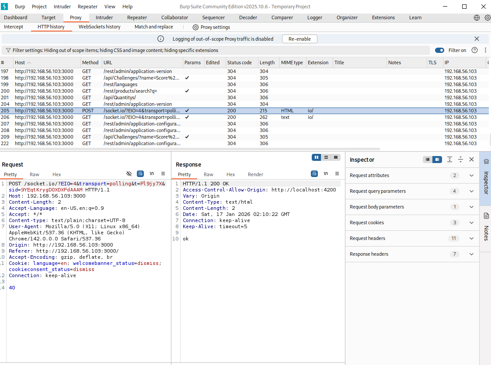
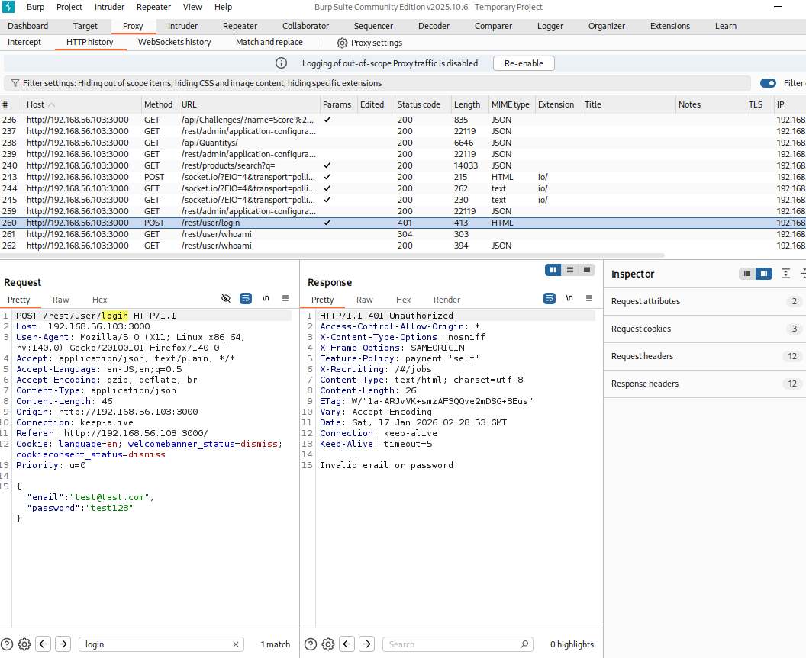

# Test Case 02 — Burp Suite Authentication Request Interception (Login POST)

## Objective
Validate that HTTP traffic from the browser is successfully routed through Burp Suite and that authentication requests generated by OWASP Juice Shop can be intercepted and analyzed.

---

## Lab Context (Scope & Ethics)
- Testing was performed in an isolated lab environment.
- Targets used are intentionally vulnerable applications.
- No external, production, or unauthorized systems were tested.
- Activities were conducted strictly for educational and defensive security research purposes.

---

## Tools Used
- Burp Suite Community Edition (Proxy, HTTP History)
- Burp Browser (preconfigured browser with proxy settings)
- OWASP Juice Shop

---

## Target
- OWASP Juice Shop (local lab deployment)
- Example URLs:
  - `http://127.0.0.1:3000`
  - `http://192.168.56.103:3000`

---

## Procedure

1. Launch **Burp Suite** and verify the proxy listener is active on:
   - `127.0.0.1:8080`

2. From Burp, open the **Burp Browser**:
   - `Proxy → Open browser`

3. Navigate to the OWASP Juice Shop login page:
http://<target_ip>:3000/#/login

4. Generate application traffic by browsing the site and attempting a login using invalid credentials.

5. In Burp, navigate to:
Proxy → HTTP history

6. Confirm that multiple Juice Shop endpoints appear in the HTTP history.

7. Filter or locate the authentication request:
POST /rest/user/login

8. Select the request and review both the **request** and **response** details.

---

## Results / Observations
- Burp Suite successfully intercepted and logged HTTP traffic from OWASP Juice Shop.
- The authentication request was captured as:
POST /rest/user/login

- The server responded with:
401 Unauthorized

- This confirms that authentication requests are observable and that invalid credentials are rejected by the application.

---

## Security Notes
- Intercepting authentication requests confirms full proxy visibility into sensitive application flows.
- Credentials, tokens, and session identifiers may be exposed if transport security is misconfigured.
- A `401 Unauthorized` response indicates server-side authentication enforcement is functioning for invalid login attempts.

---

## OWASP ASVS Mapping
- **V2.1** — Verify that all authentication requests are transmitted securely.
- **V2.2** — Verify failed authentication attempts are handled securely.
- **V3.1** — Verify session management mechanisms are protected from interception.

---

## Evidence

### Burp HTTP History Showing Juice Shop Endpoints

### Login Request Intercepted (POST /rest/user/login → 401 Unauthorized)

---

## What to Test Next
- Test for authentication bypass using SQL injection or logic flaws.
- Inspect responses for verbose error messages or leaked metadata.
- Evaluate rate limiting and account lockout protections.
- Attempt credential stuffing or brute-force simulation in a controlled manner.
- Review session cookies for secure flags (`HttpOnly`, `Secure`, `SameSite`).

---

## Status
✅ Test case completed  
📁 Evidence captured  
📌 Ready for follow-on authentication testing
