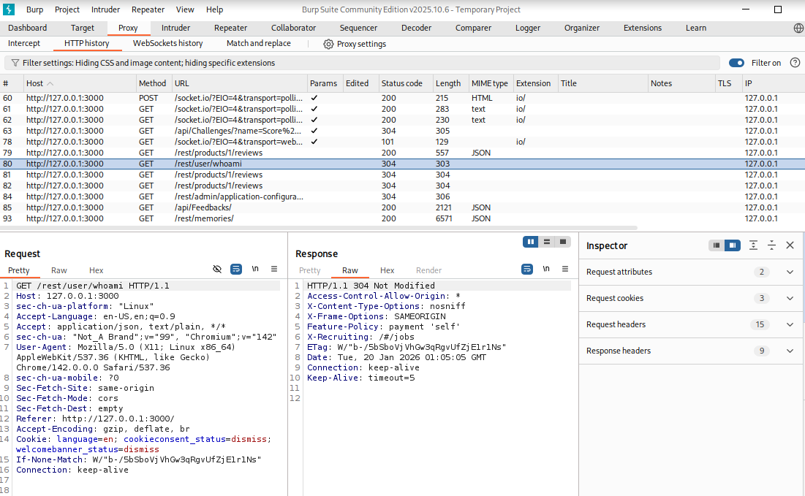
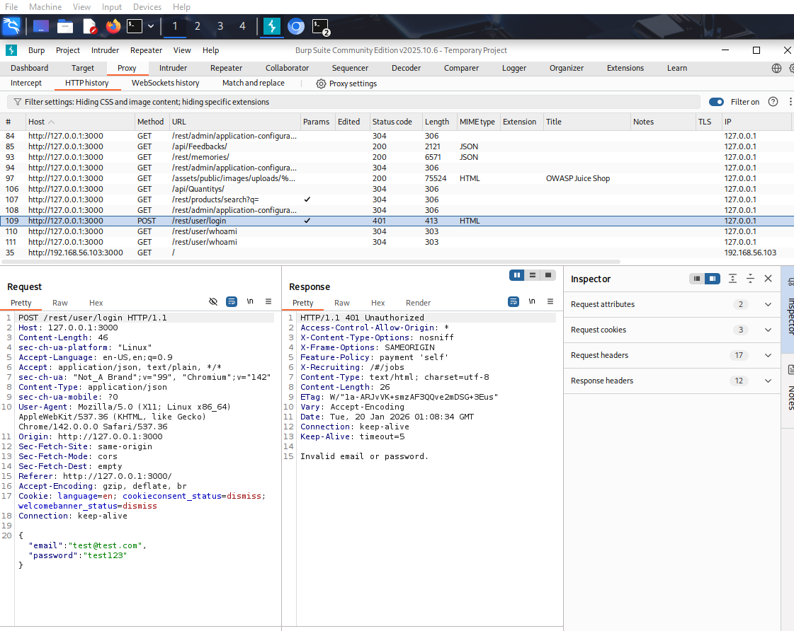

# Test Case 03 — Authentication State Validation (whoami Endpoint)

## Objective
Assess how OWASP Juice Shop determines authentication state by observing the `/rest/user/whoami` endpoint before and after login attempts.

## Lab Context (Scope & Ethics)
- Testing performed in an isolated lab environment
- Target application is intentionally vulnerable (OWASP Juice Shop)
- No production systems or real user data involved

## Tools Used
- Burp Suite Community Edition
- Burp Browser (preconfigured proxy)
- OWASP Juice Shop

## Target
OWASP Juice Shop (local lab instance)  
Example URL: `http://127.0.0.1:3000`

---

## Procedure

1. Launch Burp Suite and confirm the proxy listener is active on `127.0.0.1:8080`.
2. Open **Burp Browser** from Burp Suite.
3. Navigate to the OWASP Juice Shop application.
4. Observe background requests in **Proxy → HTTP history**.
5. Identify the unauthenticated identity request:
GET /rest/user/whoami
6. Attempt a login using invalid credentials.
7. Observe the authentication request:
POST /rest/user/login → 401 Unauthorized
8. Review subsequent `GET /rest/user/whoami` requests to validate authentication state handling.

---

## Results / Observations

- The `/rest/user/whoami` endpoint was accessible prior to authentication.
- Invalid login attempts resulted in a `401 Unauthorized` response.
- The application continued to identify the user as unauthenticated following failed login attempts.

---

## Security Notes

- Authentication state is enforced server-side, not by client UI.
- Identity-related endpoints should be reviewed for unintended information disclosure.
- Proper access controls must prevent leakage of user context prior to authentication.

---

## OWASP ASVS Mapping

- **V2.1** — Verify authentication mechanisms identify unauthenticated users correctly
- **V2.7** — Verify identity APIs do not expose sensitive information

---

## What to Test Next

- Validate `whoami` behavior after a successful login
- Inspect session tokens and cookies
- Test logout behavior and session invalidation
- Evaluate role-based access control enforcement

---

## Evidence

### Unauthenticated identity check

### Login attempt and authentication state validation

